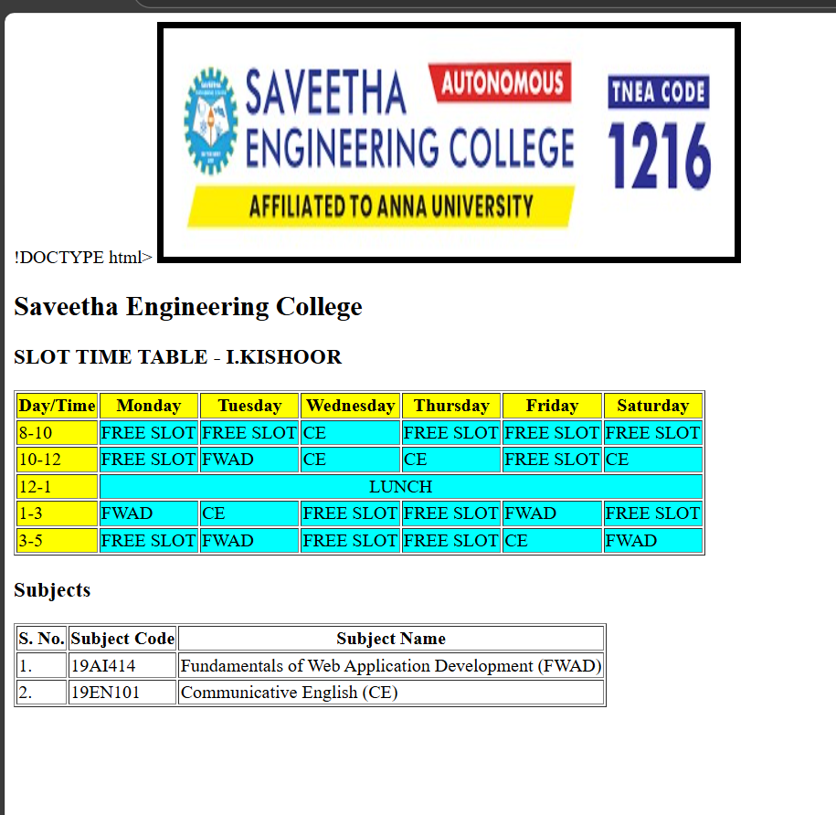

# Ex03 Time Table
## Date:07/10/2025

## AIM
To write a html webpage page to display your slot timetable.

## ALGORITHM
### STEP 1
Create a Django-admin Interface.

### STEP 2
Create a static folder and inert HTML code.

### STEP 3
Create a simple table using ```<table>``` tag in html.

### STEP 4
Add header row using ```<th>``` tag.

### STEP 5
Add your timetable using ```<td>``` tag.

### STEP 6
Execute the program using runserver command.

## PROGRAM

```
!DOCTYPE html>
<html>
<head>
    <title>Slot Time Table - I.KISHOOR</title>
</head>
<body>
    
    <h2>Saveetha Engineering College</h2>
    <h3>SLOT TIME TABLE - I.KISHOOR</h3>

    <table border="1">
        <tr BGCOLOR="YELLOW">
            <th>Day/Time</th>
            <th>Monday</th>
            <th>Tuesday</th>
            <th>Wednesday</th>
            <th>Thursday</th>
            <th>Friday</th>
            <th>Saturday</th>
        </tr>
        <tr BGCOLOR="CYAN">
            <td BGCOLOR="YELLOW">8-10</td>
            <td>FREE SLOT</td>
            <td>FREE SLOT</td>
            <td>CE</td>
            <td>FREE SLOT</td>
            <td>FREE SLOT</td>
             <td>FREE SLOT</td>
        </tr>
        <tr BGCOLOR="CYAN">
            <td BGCOLOR="YELLOW">10-12</td>
            <td>FREE SLOT</td>
            <td>FWAD</td>
            <td>CE</td>
            <td>CE</td>
            <td>FREE SLOT</td>
             <td>CE</td>
        </tr>
        </tr>
        <tr BGCOLOR="CYAN">
            <td BGCOLOR="YELLOW">12-1</td>
            <td COLSPAN=6 ALIGN="CENTER">LUNCH</td>
        </tr>
        <tr BGCOLOR="CYAN">
            <td BGCOLOR="YELLOW">1-3</td>
            <td>FWAD</td>
            <td>CE</td>
            <td>FREE SLOT</td>
            <td>FREE SLOT</td>
            <td>FWAD</td>
             <td>FREE SLOT</td>
        </tr>
        <tr BGCOLOR="CYAN">
            <td BGCOLOR="YELLOW">3-5</td>
            <td>FREE SLOT</td>
            <td>FWAD</td>
            <td>FREE SLOT</td>
            <td>FREE SLOT</td>
            <td>CE</td>
            <td>FWAD</td>
        </tr>
    </table>

    <h3>Subjects</h3>
    <table border="1">
        <tr>
            <th>S. No.</th>
            <th>Subject Code</th>
            <th>Subject Name</th>
        </tr>
        <tr>
            <td>1.</td>
            <td>19AI414</td>
            <td>Fundamentals of Web Application Development (FWAD)</td>
        </tr>
        <tr>
            <td>2.</td>
            <td>19EN101</td>
            <td>Communicative English (CE)</td>
        </tr>
    </table>
</body>
</html>
```

## OUTPUT


## RESULT
The program for creating slot timetable using basic HTML tags is executed successfully.
